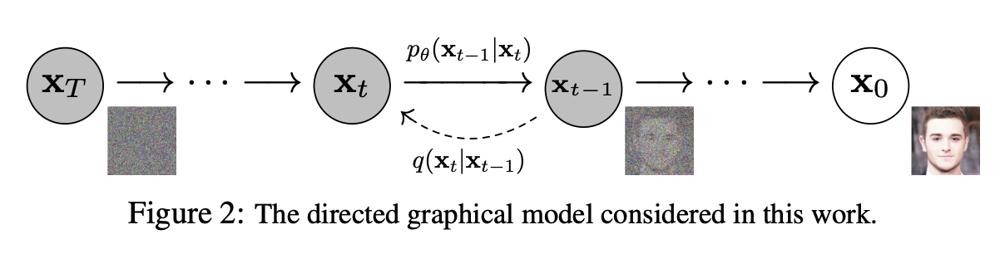

# Denoising Diffusion Probabilistic Models

We are going to re-implementing the [2020 paper **Denoising Diffusion Probabilistic Models**](https://arxiv.org/pdf/2006.11239.pdf) by implementing and training a tiny diffusion model from scratch using the [FashionMNIST](https://github.com/zalandoresearch/fashion-mnist) dataset. This paper was an influential early paper in the field of realistic image generation.

[FashionMNIST](https://github.com/zalandoresearch/fashion-mnist) is a dataset of 60k training examples and 10k test examples that belong to classes such as "Dress" or "Coat". Each image is 28x28 pixels and in 8-bit grayscale. We think of those dataset examples as being samples drawn IID from some larger input distribution "the set of all FashionMNIST images".

<figcaption><code>Figure 2</code> in <a href="https://arxiv.org/pdf/2006.11239#page=2">Denoising Diffusion Probabilistic Models</a></figcaption>

One way to think about the input distribution is a mapping from each of the $256^{28*28}$ grayscale images to the probability that the image would be collected if we collected more training examples via an identical process as was used to obtain the 60K training examples.

Our goal in generative modeling is to take this input distribution and learn a very rough estimate of the probability in various regions. It should be near zero for images that look like random noise, and also near zero for a picture of a truck since that isn't part of the concept of "the set of all FashionMNIST images".

For our training examples, the fact that they were already sampled is evidence that their probability should be pretty high, but we only have information on 60K examples which is really not a lot compared to the $256^{28*28}$ total possible grayscale images. To have any hope of mapping out this space, we need to make some assumptions.

The assumption behind the forward process is that if we add Gaussian noise to an image from the distribution, on average this makes the noised image less likely to belong to the distribution. (This isn't guaranteed - there exists some random noise that you could sample with positive probability that is exactly what's needed to turn your sneaker into a stylish t-shirt.)

The claim is that this is an empirical fact about the way the human visual system perceives objects - a sandal with a small splotch on it still looks like a sandal to us. As long as this holds most of the time, then we've successfully generated an additional training example. In addition, we know something about how the new example relates to the original example.

Note that this is similar but not the same as data augmentation in traditional supervised learning.

 In that setup, we make a perturbation to the original image and claim that the class label is preserved - that is, we would tell the model via the loss function that our noised sandal is exactly as much a sandal as the original sandal is, for any level of noise up to some arbitrary maximum. In today's setup, we're claiming that the noised sandal is less of a FashionMNIST member in proportion to the amount of noise involved.
 

Now that we know how to generate as much low-probability data as we want, in theory we could learn a reverse function that takes an image and returns one that is *more* likely to belong to the distribution.

Then we could just repeatedly apply the reverse function to "hill climb" and end up with a final image that has a relatively large probability. We know that deep neural networks are a good way to learn complicated functions, if you can define a loss function suitable for gradient descent and if you can find a suitable parameterization so that learning is smooth.